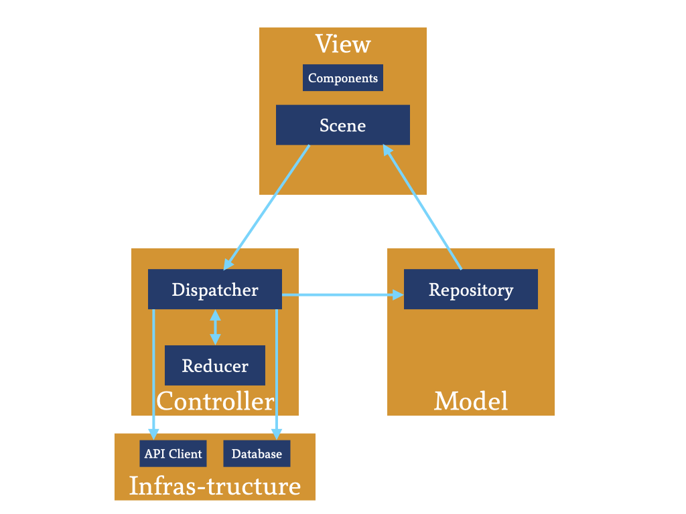
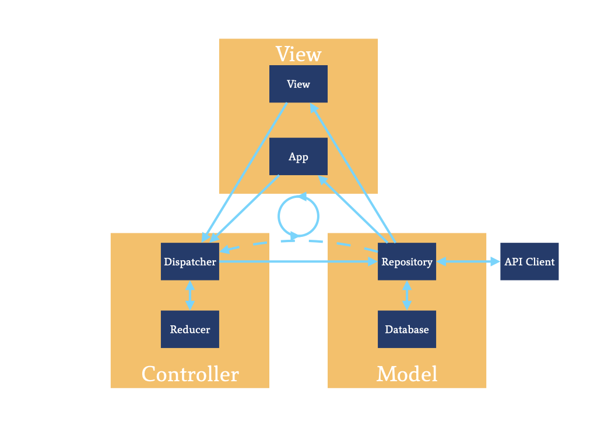

# ViDRep-Sample

ViDRep[^name] is an experimental architecture designed for SwiftUI.

[^name]: The correct spell is `ViDRep`, but case-mistakes like `Vidrep` or `vidrep` are also acceptable.

This is a sample project to show how to build an app using ViDRep.

## Why another new architecture?

Apple introduced SwiftUI in 2019, which could be considered as the replacement of the legacy UIKit framework. But unlike UIKit which has Cocoa-MVC as the recommended architecture, SwiftUI doesn't have any *Official* architecture so far.

There are already many architectures that can be used with SwiftUI, like MVVM, VIPER, Redux, SwifTEA, etc., but unfortunately there isn't a killer-architecture yet, all the architectures above has some drawbacks. For instance a traditional MVVM relies heavily on bidirectional data-binding, which is hard to read or maintain; VIPER is a good choice if you have a huge project or you're working with a big team, but obviously over-kill for small projects; Redux is also a good choice because it shares the same **Single Source of Truth** princeple with SwiftUI, but it also requires too many components which makes it hard to master.

So I decided to create a new architecture when working on my next SwiftUI project, with goals below:

1. Unidirectional data flow.

    Data flow is one of the most important keys in programming. An easy-to-track data flow makes your app easy to maintain & debug. And obviously, comparing with bidirectional data flow, unidirectional data flow is much easier to track because the condition is very simple. So the new architecture's data flow should be unidirectional.

2. Single Source of Truth.

    This is also SwiftUI's princeple, so no reason to ignore it. 

3. Make use of `ObservableObject` in Foundation
    
    Many people like using reactive frameworks like RxSwift or Combine. Sure they are very good tools to track data changes, but SwiftUI can handle change notifications from `@Published` variables declared in an `ObservableObject`, very simple. So why not just use them.

4. Testable

    No dounts how important unit tests are. So definitely components holding business logics must be designed to be easy to test.

5. Scalable

    The scale of projects may change in the future, so it'd be nice if the architecture is scalable.

## Introducing ViDRep

ViDRep is the architecture come out to achieve the goals above. I'll explain how but first let's take a look at the diagram of ViDRep:

You may notice that ViDRep looks just like an MVC (**not** CocoaMVC) pattern. That's because it IS inspired by the original MVC pattern, and it works just like the original MVC pattern: A view fires an action, the controller handles that action and updates the data model, and the data model's update triggers the view's re-rendering. It's a powerful yet very simple pattern.

But if dig deeper you'll find it's not quite the same as the original MVC. In the original MVC pattern, it's controller who fires the action, and it's model itself who handles the action. Let me explain it later.

Also if you have experiences on Redux you may find familiar on the names like `Dispatcher` and `Reducer`, which have never appeared on a traditional MVC pattern. Actually this is also where `ViDRep` come from. `Vi` stands for `View`, `D` stands for `Dispatcher`, and `Rep` stands for `Repository`.

Sometimes a component other than a `View` may also want to observe the data model updates, e.g. a global logger held by the app. For that situation you may consider `App` also as a View, then the diagram becomes like this, but the data flow is still unidirectional.

So, what do all the components do in ViDRep?

### View

`View` obviously is just a `SwiftUI.View` component. It only describes how a view should be rendered. It may also fire some actions from interactive components like buttons, but it doesn't control how that action should change the data models.

`View` will have 2 types of dependencies: a `Dispatcher` and a `Repository`. `Dispatcher` should handle possible actions that may be fired from the view, and `Repository` should present the data required by the view. It should also be `ObservableObject` so `View` can know when to update the rendering.

### Dispatcher

`Dispatcher` should handle events fired from a `View`, by asking the reducer to generate a new data (or a state if you're familiar with Redux) from given event, and then stores the new data into `Repository`. If needed `Dispatcher` may also directly get required data from `Repository` when the given event doesn't contain all required information, this is why on the diagram above there's a dotted line between `Dispatcher` and `Repository`.

`Dispatcher` might be `ObservableObject` if wants to use it as `@EnvironmentObject`, but it should be stateless.

`Dispatcher` will also have 2 types of dependencies: a `Reducer` and a `Repository`. `Reducer` should generate a new data from given data and action, or on other words, should handle the business logic. `Repository` should be able to store the new data.

If the business logics are too simple, or the scale of the project/team is too small, you may also choose to contain the reducer logics inside the `Dispatcher` to get rid of the `Reducer`. This could make writing unit tests a tiny little bit difficult comparing with having the independent `Reducer` component, but it takes much fewer lines of code on the other hand.

### Reducer

`Reducer` should handle the business logics by generating new data from given data and action. A `Reducer` should be pure functions with no states or side effects, so it'd be very easy to write unit tests.

`Reducer` should have no dependencies. This also makes it easy to write unit tests since you don't need any mock components.

### Repository

`Repository` should just store data from `Dispatcher`. It may also read/write data into `Database` for those need persistence, and get/post data to servers via `APIClient`. But it shouldn't contain any business logic, because a stateful object is difficult to test. It should just store the data as-is.

`Repository` should also be `ObservableObject` so a `View` can get notified when some data will change.

And just like `Dispatcher`, if the scale of the project/team is too small, you may also choose to contain the database logics inside the `Repository`.

`Repository` is the source of truth in the project, therefore it should be only **ONE SINGLE** repository.

`Repository` may have 2 types of dependencies if needed: a `Database` and an `APIClient`.

### Database

`Database` is where data get persistent. A typical `Databse` is `UserDefaults`.

`Database` should have no dependencies.

### APIClient

`APIClient` is the component communicating with servers to get/post data. Since it's basically working asynchronously, asynchronous event handling libraries like `Combine` or `PromiseKit` may be helpful, but you may still choose callbacks to handle the asynchronous data process.

`APIClient` should have no dependences.

## Why ViDRep

Now let's see how this `ViDRep` achieves the goal I listed above.

1. Unidirectional data flow.

    Since it's inspired from MVC and Redux, it's obvously unidirectional. Data goes from `View`, to `Controller`, to `Model`, and at last back to `View` again.

2. Single Source of Truth

    In ViDRep there should always be only one single `Repository`, and the `Repository` is the single source of truth.

3. Make use of `ObservableObject` in Foundation
    
    In ViDRep, `Repository` is `ObservableObject`, which `SwiftUI.View` can get notified when it's going to change. This makes it really easy to maintain the `View` code since you don't need to care about the reactive concepts like streams.

4. Testable

    Business logics are all concentrated in `Reducer`s. And since `Reducer`s are stateless and only contain pure functions, it's very easy to write unit tests.

5. Scalable
    
    Unlike Redux or VIPER, some components in ViDRep are not essential, e.g. `Reducer` and `Database`. And even if you choose not to make a `Reducer`, business logics in `Dispatcher`s are still not difficult to test.

## Any disadvantages?

Every architecture has its own disadvantages, and ViDRep is not excluded. One of the big disadvantages is that since it should only have one single `Repository`, if there are too many states held by app, the `Repository` may become massive.

Another issue you may meet is if you have complex presentation logics, your `View` may become fat since ViDRep isn't designed to have a `ViewModel`. You may still create a `ViewModel` if you like, but 1) if your `ViewModel` only handles the data sent from `Repository`, `View` won't have the original data type, and that may have difficulty when trying to send actions with data to `Dispatcher`; and 2) if your `ViewModel` handles both data sent from `Repository` and data sent to `Dispatcher` that means you're having a bidirectional data binding between `View` and `ViewModel`, which you may need cautious when handling the data flow.
